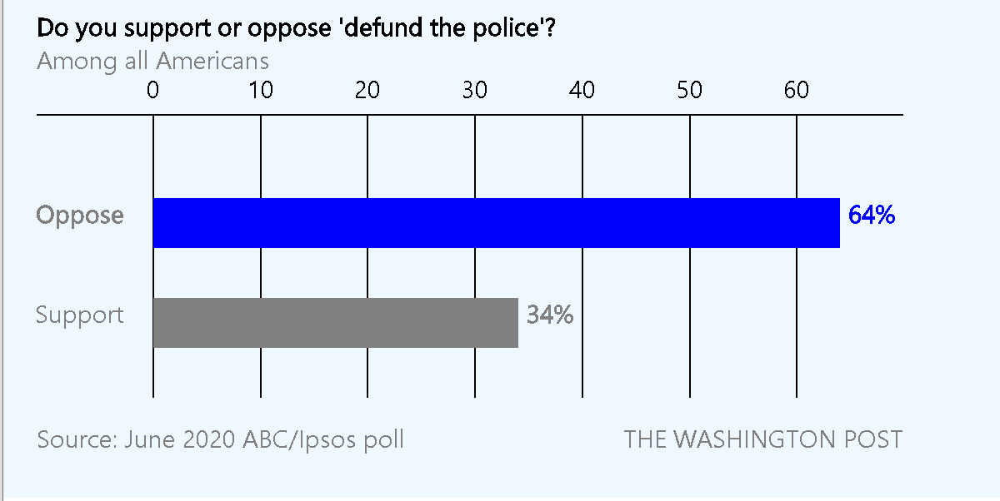
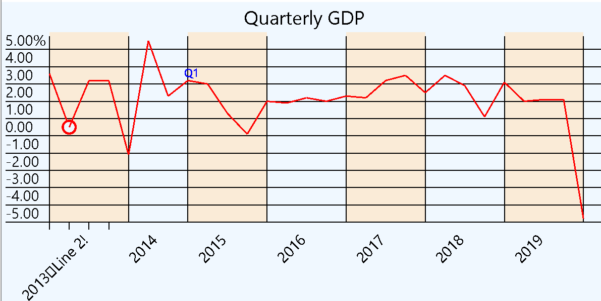
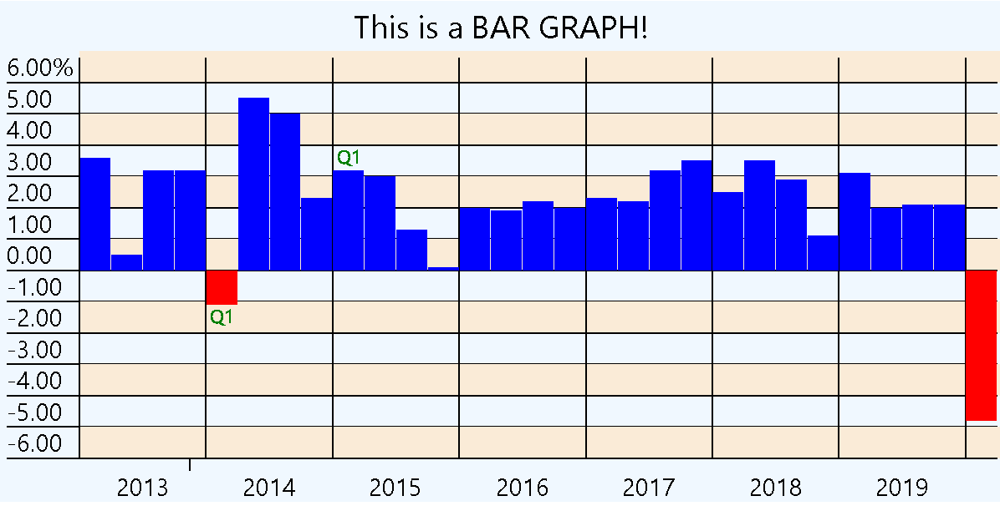
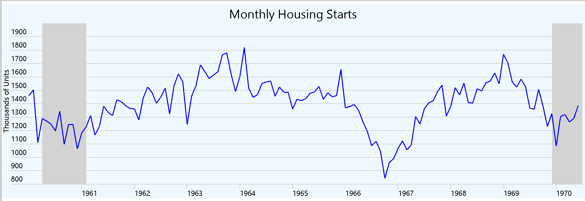
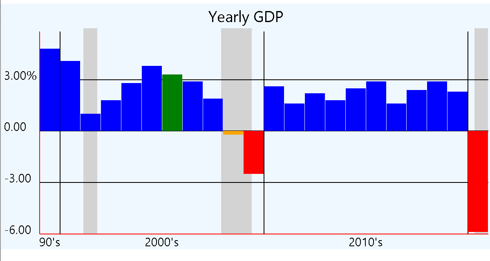
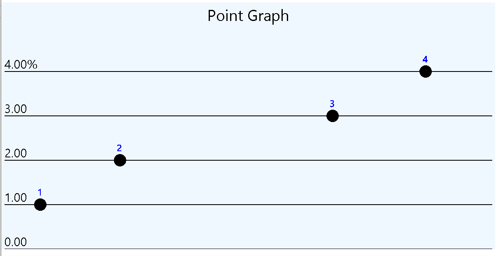
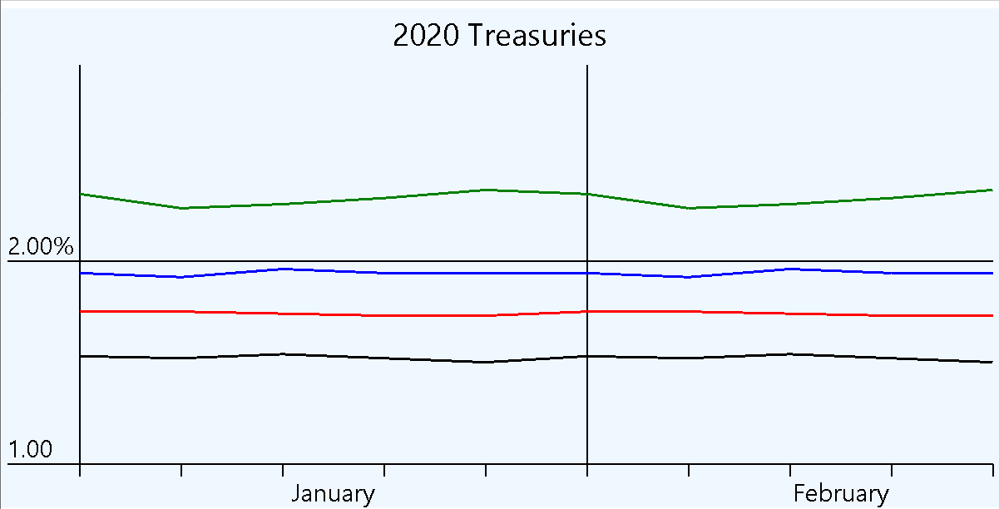
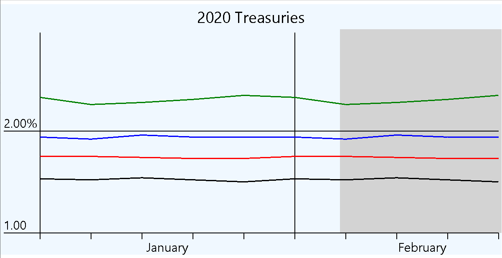

# Graph Types

All data in example graphs is actual government data, except for Horizonal Bar Graph, which replicates a graph from The Washington Post and Point Graph, which is just made up data point values.
All graphs, except Horizonal Bar Graph and Point Graph, assume a progression of ordered data, such as in time ordered sequence and have data spaced horizontally based on width of graph and number of data points.

# Horizontal Bar Graph
Used to show comparison of multiple values, such as survey results.

# Line Graph
Graph with lines from one point to the next.

# Bar Graph
Graph with vertical bars

# Shaded Line Graph
Same as Line Graph, but with option to show some parts of graphs in a shaded color, such as representing recessions (which is what the example shows).

# Shaded Bar Graph
Same as Bar Graph, but with option to show some parts of graphs in a shaded color, such as representing recessions (which is what the example shows).

# Point Graph
Shows relative values of data points.  Unlike the other graphs, each data point has two values: Value, which is the vertical value and XValue, which is the horizontal value.
Data points can be in any order.  X-Axis will be calculated based on XValue values of the data points.

# Multi-Line Graph
Same as Line Graph, but with multiple lines of data.  Each line can/should have a separate color.  In the example, the data shows how something a graph of treasuries differing durations.  This can be used to determine inverted yield curves, which is a recession indicator.

# Shaded Multi-Line Graph
Same as Multi-Line Graph, but with option to show some parts of graphs in a shaded color, such as representing recessions (which is what the example shows).

To use, include EconomyGraph nuget in your project.  This is a .NET Standard nuget, but will only work with Xamirin Forms projects.  Although this nuget only needs to be included in the "Shared" project of a Xamarin Forms project, the Skia Sharp dependency needs to be included for all platform projects as well.

# Graph usage

In your .xaml file, include the xaml assembly reference at the top:
             xmlns:contentviews="clr-namespace:EconomyGraph.Views.ContentViews;assembly=EconomyGraph"

In your page xaml, add the appropriate graph content view, specifing the desired height and width.  The ViewModel property needs to be bound to an instance of the viewmodel class corresponding to the specified graph.
<contentviews:LineGraphView GraphWidth="800" GraphHeight="400" ViewModel="{Binding LineGraphViewModel}"/>

# Line Graph / Multi-Line Graph Properties
These properties also apply to Bar Graph, Point Graph, Shaded Line Graph and Shaded Bar Graph

Size of text and text color is customizable for all text displayed.  Text can be displayed normal or in bold.

All colors are defined of type SKColor.  The example application using Skia Sharp pre-defined colors, but you are NOT limited to this. See SkiaSharp documentation for more information.
All graphs can set the background color.  This color is set for entire specified canvas, not just the graph portion.

|Property|Required|Purpose|Usage|
|-|-|-|-|
|Background Color|No|If set, entire canvas will be set to this color|Set to desired color|
|BottomGraphValue|Default=0 or lowest Y-Axis data value|Set to override bottom value of graph.  Value cannot be less than minimum data value.|double|
|CenterFooter*|No|Text for center footer|See examples for Label values|
|DataGroups|Yes|Group data for the graph.|List of DataGroup or MultiLineDataGroup, depending on graph.|
|LeftFooter*|No|Text for left footer|See examples for Label values|
|LeftLabel|No|Text to display vertically on left size of canvas|See examples for Label values|
|LineColor|Default=Black|Default color for lines between data points.|Set to desired color|
|HorizontalBottomLineColor|No|Color for X-Axis line at bottom of graph. Overrides HorizontalLineColor for bottom graph line|Set to desired color|
|HorizontalLineColor|No|Color for horizontal lines across graph|Set to desired color|
|HorizontalLinesStartAtEdge|Default=true|If HorizontalLineColor is set, then lines will start at left of canvas (after LeftLabel). If false, then lines start at left of graph|true or false|
|IndicatorLineLength|Default=10|Length of line below X-Axis to identify horizonal positioning on x-axis of data point.  Only used if datapoint is marked as having indicator line.|float|
|OddRowHorizontalColor|No|Set to desired color for odd row horizontal shading|Set to desired color, null for no shading|
|OddRowVerticalColor|No|Set to desired color for odd row vertical shading|Set to desired color, null for no shading|
|Padding|Default=5|Padding between lines of text and for border of graph|float|
|RightFooter*|No|Text for center footer|See examples for Label values|
|Title*|No|Title to be displayed at top of graph.|See examples for Label values|
|TopGraphValue|No|Set to override top graph value with a higher value|double|
|VerticalLabelPrecision|Yes|How granular you want the values for the Y-Axis|float|
|VerticalLeftAxisColor|No|Color for vertical axis line at left of graph. Overrides VerticalLineColor for first line|Set to desired color|
|VerticalLineColor|No|Color for vertical lines across graph|Set to desired color|
|XLabelAlignment|Default=Start|Set to change alignment of labels in data groups|Xamarin.Forms TextAlignment|
|XLabelColor|Default=Black|Set to desired label color|Set to desired color|
|XLabelPointSize|Yes|Set to desired label text size|float|
|XLabelRotation|Default=Horizontal|Set to desired label rotation|LabelRotation enum|
|YFirstLabelFormat|Yes|Format for display of top most label based on Y-Axis values|See c# string formatting documentation|
|YLabelAlignment|Default=Start|Alignment for label text|Xamarin.Forms TextAlignment|
|YLabelColor|Yes|Color for display of Y-Axis labels|Set to desired color|
|YLabelFormat|Yes|Format for display of non-top most label based on Y-Axis values|See c# string formatting documentation|
|YLabelPointSize|Yes|Text size for Y-Axis labels|float|

*Can be multi line.  use \n to designate line breaks. Example: First Line\nSecond Line

# Shaded Line Graph / Shaded Multi-Line Graph Properties
All properties from LineGraph, plus: 

|Property|Required|Purpose|Usage|
|-|-|-|-|
|StartDate|Yes|Start date of graph|DateTime|
|ShadedPeriods|Default=U.S. Recessions|Starting/Ending dates for possible shaded areas|List of ShadePeriod|
|ShadedAreaColor|Yes|Set to color for shaded areas|Set to desired color|

# Bar Graph / Shaded Bar Graph Properties
All properties from Shaded Line Graph, plus: 

|Property|Required|Purpose|Usage|
|-|-|-|-|
|BarColor|Default=Blue|Color for positive value bars|Set to desired color|
|BarDefaultWidth|No|Set to override auto-calculated bar width|float|
|NegativeBarColor|Default=Red|Color for negative value bars|Set to desired color|

# Point Graph Properties
All properties from LineGraph, except properties for lines between data points, plus: 

|Property|Required|Purpose|Usage|
|-|-|-|-|
|CircleRadius|Yes|Set to radius of data points|float|
|CircleType|Default=None - this MUST be SET|Defines type of data= points.|Donut or Solid|
|MaxXValue|No|Set to override max X value for graph with value larger than data points|double|
|PointColor|Yes|Color for sll data points|Set to desired color|

All properties are demonstrated in the provided graphs with the example app.  See examples for more information.